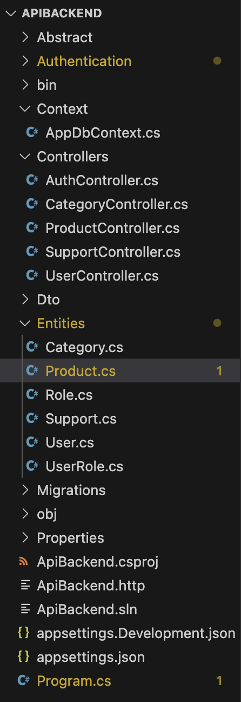
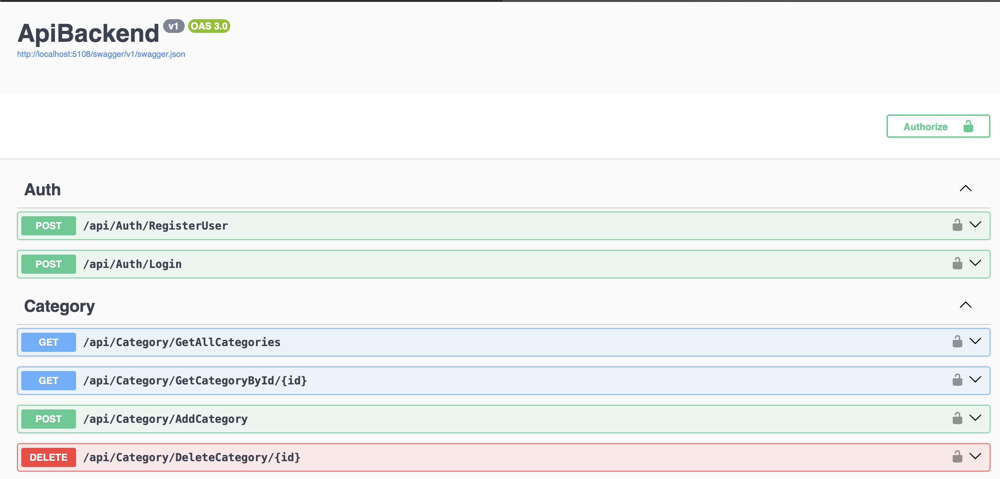

# .Net Entity Framework Code First ile web api projesi 🚀🚀

## Kurulum ve Paketler

Nuget Packages:

- `Microsoft.EntityFrameworkCore`
- `Microsoft.EntityFrameworkCore.Tools`
- `Microsoft.AspNetCore.Authentication.JwtBearer`
- `Microsoft.AspNetCore.OpenApi`
- `Pomelo.EntityFrameworkCore.MySql`
- `Swashbuckle.AspNetCore`

## Entity Framework CLI Commans 

- `dotnet restore`
- `dotnet ef migration add InitialMigration`
- `dotnet ef update database`
- `dotnet run`

## Kullanılan Teknolojiler

- `Entity Framework Core ile MySQL bağlantısı`
- `JWT tabanlı kimlik doğrulama`
- `Katmanlı mimari: Controllers, DTOs, Context, Authentication, vs.`

## Kullanıcı giriş bilgileri 

- `usurname : efe`
- `password : efe123`

## Apı Dokümantasyonu

- `POST : "/api/Auth/Login" Giriş yapan kullanıcıya token döner`
- `GET  : "/api/Category/GetAllCategories" Tüm kategorileri dönderir`
- `GET  : "/api/Category/GetCategoryById/{id}" Id'ye göre bir kategori döner`
- `POST : "/api/Category/AddCategory" Kategori ekler`
- `PUT  : "/api/Product/UpdateProduct/{id}" Id değerine göre ürün günceller`
- `DELETE : "/api/Product/DeleteProduct/{id} Id değerine ait ürünü siler`

  
  
  
